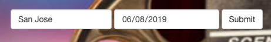
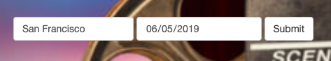

# CMPE226

## Movie Booking Application

### To Run Application 

```
cd cmpe226
pip install -r requirements.txt
python server.py
```

---

### Technologies:

#### Front-end:
```
- Jinja
- HTML
```

#### Back-end:
```
- Python
- Flask
```

#### Database:
```
- MySQL (AWS RDS)
- MongoDB (mLab)
```

---

### Login Details

###### User Login

| Name          | Email                     | Password   |
|---------------| ------------------------- | -----------|
| User1         | user1@gmail.com           | User1      |

###### Owner Login

| Name          | Email                | Password        |
|---------------| ---------------------| ----------------|
| Admin1        | admin1@gmail.com     | Admin1          |
| Admin2        | admin2@gmail.com     | Admin2          |
| TestAdmin     | testadmin@gmail.com  | TestAdmin       |

---

### Data Details

1. Currently the database contains data for San Francisco and San Jose city.
2. With in following date range: 2019-06-01 to 2019-06-11

Examples:




